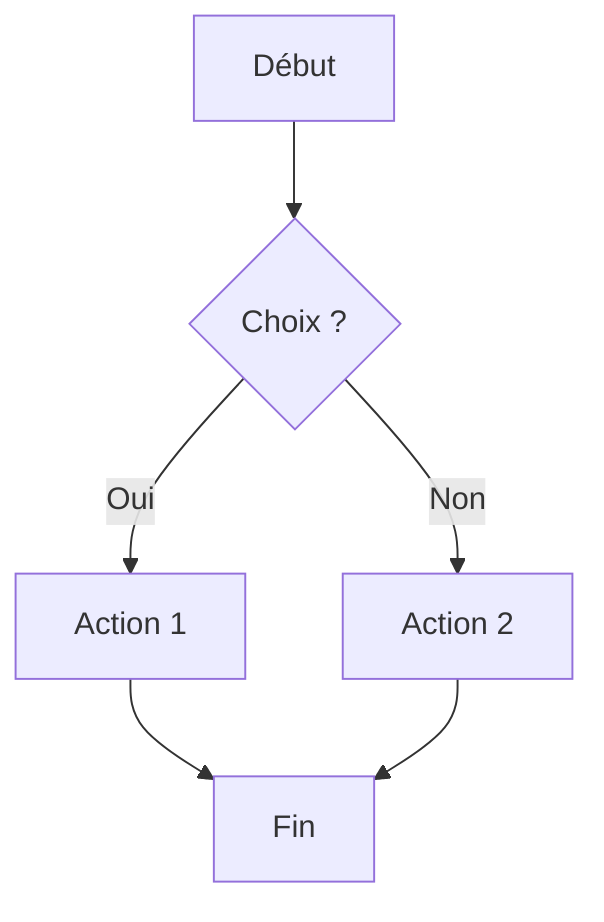
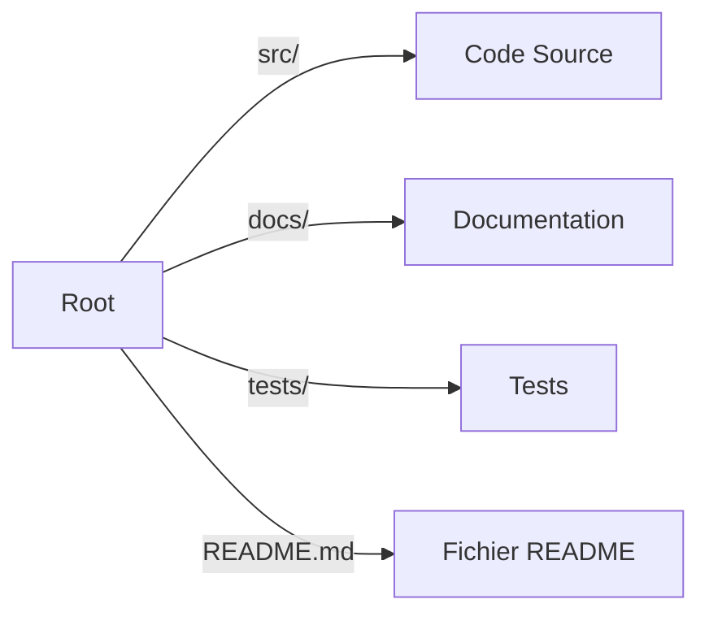

# Projet Exemple

Bienvenue dans ce projet ! Voici une brève description de son contenu et de son organisation.

## Description

Ce projet sert d'exemple pour un README contenant du code Mermaid. Il illustre la structure d'un projet avec un diagramme simple.

## Diagramme de Flux



## Structure du Projet



## Installation

```bash
git clone https://github.com/votre-repo.git
cd votre-repo
```

## Usage

1. Lancer le projet : `./start.sh`
2. Consulter la documentation dans `docs/`
3. Exécuter les tests : `pytest tests/`

## Contribuer

Les contributions sont les bienvenues ! Merci de suivre les bonnes pratiques de développement.

## Licence

Ce projet est sous licence MIT.

